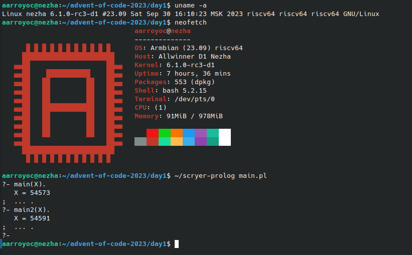

# advent-of-code-2023
My solutions for AoC 2023

My objective this year is that all solutions run in the Mango Pi MQ-Pro, a RISC-V64 SBC based on the Allwinner D1 chip and the Nezha platform.

The operating system I'm using on the Mango Pi is a community build of Armbian 23.09:

- https://forum.armbian.com/topic/21465-armbian-image-and-build-support-for-risc-v/
- https://disk.yandex.ru/d/da8qJ8wyE1hhcQ/Nezha_D1/ArmbianTV/20230930-current

Languages and systems used:

- Prolog / Scryer Prolog v0.9.3
